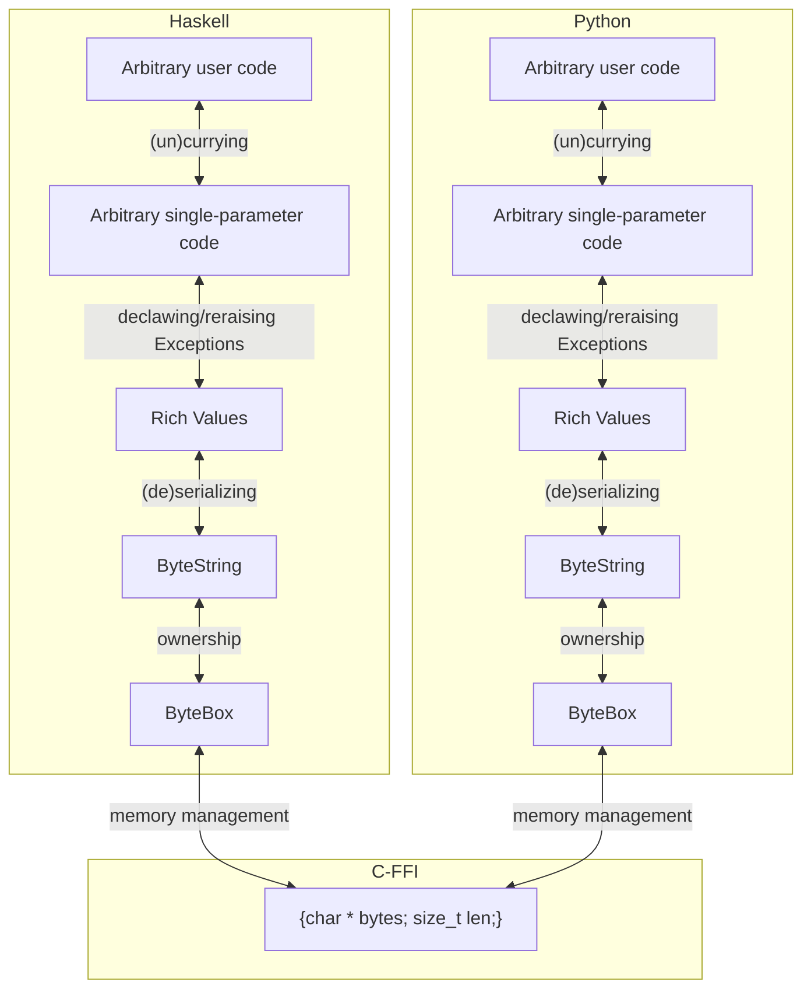

# Virgil FFI 

Virgil FFI is a super simple and easy-to-use foreign function interface to call Haskell <-> Python.

Its main goals are _simplicity_, _safety_ and _flexibility_.

Virgil FFI is named after Dante's guide in the 'Divine Comedy', who guides him through the nine circles of hell and purgatory and finally reach heaven.
Virgil FFI takes inspiration from the article [Calling Purgatory from Heaven: Binding to Rust from Haskell](https://www.well-typed.com/blog/2023/03/purgatory/) and the classic paper [Calling hell from heaven and heaven from hell](https://dl.acm.org/doi/10.1145/317636.317790) which first introduced the Haskell FFI.
And just like there are nine circles in hell, Virgil FFI also has multiple 'levels'. The interface is implemented as a small number of higher-order-functions that do incremental 'lifting' and 'lowering' of user-defined functions between these levels. 

The result is a very clean, maintainable and extensible system.

Virgil-FFI was presented during the [PyUtrecht meetup of 2024-09-17](https://www.meetup.com/pyutrecht/events/302995529/?eventOrigin=group_upcoming_events).
[Find the Slidedeck here](https://slides.com/martenwijnja/pyutrecht-this-is-ffine).

**Note that Virgil-FFI was researched/built during a one-day Hackathon. While the result is decent, you should consider it as a building block for your own FFI systems, rather than treating it as a fully finished system.**


## Features

- [x] Start the Haskell Runtime from Python
- [x] Call Haskell functions from Python
- [x] Call back into Python from Haskell, _by passing arbitrary Python callables to a Haskell function_.
- [x] Pass arbitrary Python/Haskell types (as long as they are JSON or CBOR serializable)
- [x] Raised Exceptions bubble up from Haskell to Python, and from Python to Haskell, _including a cross-language stacktrace!_
- [x] Haskell's threaded runtime can do anything it wants in the background as it is not impacted by the GIL
- [x] Very hard to accidentally cause 'segmentation faults' or other kind of memory corruption or undefined behavior: Values passed between languages are type-checked at the other side.
- [x] Reasonably efficient: Overhead of calling a foreign function is the JSON/CBOR serialization overhead + `malloc/free` of the intermediate byte buffer.
- [x] Supports functions of any arity, written in idiomatic style. (Implemented using the unpacking operator in Python and a currying trick in Haskell)

TODO:

- [ ] Tests
- [ ] Managing the shared library location with Nix. (Currently using a symlink.)

## Limitations

- Passing Haskell functions as callbacks to Python is not (yet) supported, but adding support would be easy.
- Callbacks (to closures that capture data) should be used before the function they were passed to returns. Storing them for longer and calling them later could cause memory corruption.
  Solving this would require a more complicated implementation so Haskell could indicate to Python's GC when the object goes out of scope according to its GC (and vice versa).
- Currently, users can choose CBOR or JSON for serialization. This allows for support of a lot of basic types, but for specialized types this might require adding extra JSON/CBOR serialization hooks.
- Signal handlers: Both languages have a set of (default) signal handlers, but only one of the two can be active at a given time. Currently there has been chosen (c.f. `cbits/virgil_wrapper.c`) to restore the Python signal handler after Haskell has started up, but this means that if Haskell is executing for a long time without calling any Python, `SIGINT` (Ctrl+C) will not trigger a (Haskell)`UserInterrupt`/(Python)`KeyboardInterrupt`. See [this longer explanation on the Hyphen project for more details](https://github.com/tbarnetlamb/hyphen?tab=readme-ov-file#notes-on-signals-and-keyboard-interrupts).

## How to use

### On the Haskell side:

- Create a new Cabal project (wrapped with Nix), in which you depend on the `virgil` library.
- Its build target should be a `foreign-library` of the type `native-shared`. See the example project for details.
  - Make sure to include (a copy of) `cbits/virgil_wrapper.c` in the `c-sources` of the new foreign-library.
- Inside the main foreign library module, add the function:
```haskell
foreign export ccall virgilRealloc :: Ptr a -> Int -> IO (Ptr a)
virgilRealloc :: Ptr a -> Int -> IO (Ptr a)
virgilRealloc ptr size = Foreign.Marshal.reallocBytes ptr size
```

This is required to allow Python to allocate/deallocate byte buffers in the same way as Haskell.

- Besides this 'special' function, add any function you like. The parameters of these functions can be any type that have an `Aeson.FromJSON` instance and the output must have an `Aeson.ToJSON` instance. These typeclasses are used to convert the parameters/output from/to CBOR (using `cborg-json`) or JSON (using `aeson`).
- The actual outward type signature should be `VirgilFunction`, and above the function add `foreign ccall export myFunctionName :: VirgilFunction`. Inside, use `Virgil.lowerCBOR` (or `Virgil.lowerJSON`) and call your real function implementation.

Example:

```haskell
-- | Divide two integers
foreign export ccall divIntegers :: VirgilFunction
divIntegers :: HasCallStack => VirgilFunction
divIntegers = Virgil.lowerCBOR impl
  where
    impl :: HasCallStack => Integer -> Integer -> IO Integer
    impl left right =  pure $ div left right
```

You can use any type supported by `Aeson` in the signatures. If you want to be able to have Python pass values of `Any` (serializable) type, use `Aeson.Value`.

To accept callbacks as parameters, rather than writing their type as `(a -> b -> IO c)` (which is not serializable),
write `ForeignClosure (a -> b -> IO c)` (which is!).
You can turn an object of this type into a 'normal' callable function using `ForeignClosure.liftCBOR` (resp. `liftJSON`).
_(Be sure to not store these callbacks or functions created from them after your function returns; see 'limitations'!)_

```haskell
-- | Call a Python function on each element in an list, returning that list
foreign export ccall mappy :: VirgilFunction
mappy :: HasCallStack => VirgilFunction
mappy = Virgil.lowerCBOR impl
  where
    impl :: HasCallStack => [Aeson.Value] -> ForeignClosure (Aeson.Value -> IO Aeson.Value) -> IO [Aeson.Value]
    impl list callback = do
      let fun = ForeignClosure.liftCBOR callback
      mapM fun list
```

Your function is now ready to be called from Python!

### On the Python side

You can load the Haskell dynamic library like so:
```python
import virgil
dll = virgil.DynamicLibrary("path/to/NameOfCompiledLibrary.so")
```

To expose and wrap one of the Haskell functions from python, use the `liftCBOR`/`liftJSON` functions on the `DynamicLibrary` instance:

```python
haskellDivIntegers = dll.liftCBOR("divIntegers")
def divIntegers(left: int, right: int) -> int:
    """
    Divide two integers (secretly using Haskell)
    """
    return haskellDivIntegers(left, right)
```
Note that:
- The `liftCBOR` call is on the top source level. 
  - This makes sure that if the function cannot be found, an error happens when the module is loaded (usually on app startup) rather than only when the function is called.
  - It also is more efficient as it is only called once.
- In the Python wrapper you can add any type hints and documentation.
  - And if desired you can do any preprocessing/postprocessing as well.

If you want to pass a callback to Haskell, call `dll.lowerCBOR`/`dll.lowerJSON` on a callable object:

```python
haskellMappy = dll.liftCBOR("mappy")
def mappy(elems: list[Any], fun: Callable[[Any], Any]) -> list[Any]:
  """
  Call a Python function on each element of an integer list,
  returning the resulting list.
  """
  return haskellMappy(elems, dll.lowerCBOR(fun))

```

You're now ready to call the code:

```python
>>> import example
>>> example.mappy([1,2,3,"a", [3,4,5]], lambda x: x * 2)
[2, 4, 6, 'aa', [3, 4, 5, 3, 4, 5]]
```


## Implementation

### Levels

Virgil FFI is implemented as a stack of 'levels', with higher-order-functions (functions that operate on other functions) that lift resp. lower user-defined functions to higher (more versatile) resp. lower (more fundamental) levels.




By implementing both a 'lift' and a 'lower' function in both languages, we gain the following benefits:

- Individual parts are very easily understood/maintained on their own.
- Individual parts can easily be tested: In the Haskell unit test suite we can lower a normal Haskell test-function rather than requiring a full Python function. (and vice-versa)

### 0: C

This is the 'starting' level. Both languages' FFI bindings are able to already talk C.
However, C is a very crude language. Many more complicated constructs cannot easily be expressed at this level.

The main thing we use the C level itself for, is to communicate to Python where to find `realloc`.
`realloc` can be used to allocate, resize and deallocate arbitrary byte buffers.
However, it is paramount that both languages use the same memory allocator for this.
As it cannot be guaranteed that the Python interpreter and the Haskell shared library were compiled/linked against the same memory allocator,
exposing the memory allocator in use by Haskell is the easiest way to guarantee compatibility.

### 1: Memory management using a 'ByteBox'

We're now able to create byte buffers in one language and pass them to the other language which can destroy them.
However, in order to read from these buffers, it is necessary to know how _large_ they are.

As we may be dealing with binary data that can contain null bytes, the normal C string type AKA 'null-terminated-byte-string' is not a good choice.

Instead, we implement a very simple 'fat pointer' type in both languages.
At both sides, we write whatever is necessary to construct/destruct and read/write from a datastructure which in C would look like:

```C
struct ByteBox {
  char *bytes;
  size_t size;
}
```

Since both the `ctypes` library in Python and the builtin FFI capabilities in (GHC) Haskell prefer structs to live behind pointers rather than passing/returning them directly from functions,
we choose to use the core FFI type:

```C
void virgil_function(const ByteBox *input, ByteBox *output);
```
Equivalent Haskell:
```haskell
type VirgilFunction = Ptr ByteBox -> Ptr ByteBox -> IO ()
```

Equivalent Python:
```python
somedll.myfunction.argtypes = [ctypes.POINTER(ByteBox), ctypes.POINTER(ByteBox)]
somedll.myfunction.restype = None
```

So the first parameter is an _input parameter_ and the second parameter is an _output parameter_.
We establish the convention that the output parameter will be:
- allocated by the caller (with a 0 size and a `nullptr` buffer),
- filled by the callee (by allocating a buffer of the appropriate size),
- and deallocated again by the caller (including deallocating buffer).

### 2: More idiomatic data ownership / calling convention using ByteStrings

Level 1 abstracts all necessary details of C away, but manually writing to an output parameter feels non-ergonomic in Python and Haskell.

Luckily, it is very easy to add a small wrapper on top, which from the outside looks like

```haskell
level1Function :: ByteString -> IO ByteString
```

```python
def level1Function(input: bytes) -> bytes:
    ...
```

If we want to be _super duper_ safe, we could `memcpy` the bytes to/from the ByteBox objects.
However, since level 1 will outside of Virgil FFI's own unit test suite only be used from level 2, it is okay to 'borrow' the same underlying buffer.

### 3: Supporting Rich Values

Level 2 works well, if all you ever want to do is pass bytestrings back and forth.
But it is easy to add support for other values on top, by serializing/deserializing (AKA encoding, marshalling, pickling, ...) them using a common serialization format.

Currently, Virgil FFI implements CBOR and JSON. It is recommended to use CBOR everywhere as it is much more efficient, 
except when debugging the internals of Virgil FFI for which the human-readability of JSON is nice.

Note that Virgil currently uses the `cborg-json` library Haskell-side, which might somewhat limit what types are supported.

On this layer, we make sure that if the input from the other side cannot be parsed,
that this does not result in an exception, but rather that such an error is turned into and passed on as a value.

This is done so we can delay exception handling to its own level, and test the serde-ing on its own.

### 4: Declawing / reraising Exceptions

We have now arrived at the final real level: Dealing with exceptions.

The main thing to do here, is to turn exceptions into values when lowering, and to turn exception-values back into exceptions when lifting.

The mapping between exceptions and values is done using the basic `Either` type in Haskell.

On the Python side, this type looks like

```python
ExceptionOrValue: {'Left': ExceptionValue} | {'Right': Any}

ExceptionValue = {'name': str, 'message': str, 'callstack': list(CallstackFrame), annotations: list(str)}
CallstackFrame = tuple(str, {'file': str, 'line': int, 'col': int})
```

A little bit of helper code is used to be able to turn a `list(CallstackFrame)` to/from a Haskell `CallStack` and a Python `Traceback` object.
Also, a select few common exceptions that exist in both languages are mapped between (like division by zero and SIGINT).

### 5: Supporting multiple parameters

We are now able to pass arbitrary values and run arbitrary code, which might even throw exceptions.
However, one thing is still non-ergonomic: if we want to pass multiple parameters to the other side, we have to combine them together (in a list or tuple).

There exist a very simple convention to improve this however: Always serialize the input parameters as a list. (Even if there are zero or only one parameter!)
That way, any number of parameters can be handled uniformly on the other side.

In Python, the packing/unpacking operator `*` is used to turn multiple parameters into a list of arguments, and inside closures a list of parameters back into individual parameters.

In Haskell, a fancy little typeclass (c.f. the `Curry` module) is used to pass a tuple of arguments to a normal fully-curried function. (And do 'full uncurrying' for closures).

### Extra: Supporting Foreign Closures

We can now call completely arbitrary code from one language in the other, idiomatically. 
However, there is one final thing to make the interface extra flexible: support for closures.

The only thing we need to do to pass a closure, is to go through the levels in reverse:
We _lower_ a closure down through all the levels until it has become a `VirgilFunction`, and in the other language _lift_ it again until it is a normal callable function.

However, there is a little problem: a `VirgilFunction` is itself not CBOR/JSON serializable!
But, this is easily solved: By using the fact that on x86 (and most other mayor) architectures, function pointers are word size just like normal integers,
we can turn the resulting function pointer into a `{'foreignFunctionAddr': raw_function_addr}` dict.
A serializaion handler is installed at both ends to make sure that this kind of dictionary is always recognized as a callable closure at the other end.

## Acknowledgements


Besides the article [Calling Purgatory from Heaven: Binding to Rust from Haskell](https://www.well-typed.com/blog/2023/03/purgatory/) and the classic paper [Calling hell from heaven and heaven from hell](https://dl.acm.org/doi/10.1145/317636.317790), there was a lot of useful information in the [Hyphen project](https://github.com/tbarnetlamb/hyphen?tab=readme-ov-file). It also implements a FFI interface between Python and Haskell, although Hyphen works on Haskell source code: It expects GHC to be installed on the target system and tries to compile Haskell code on the fly.
